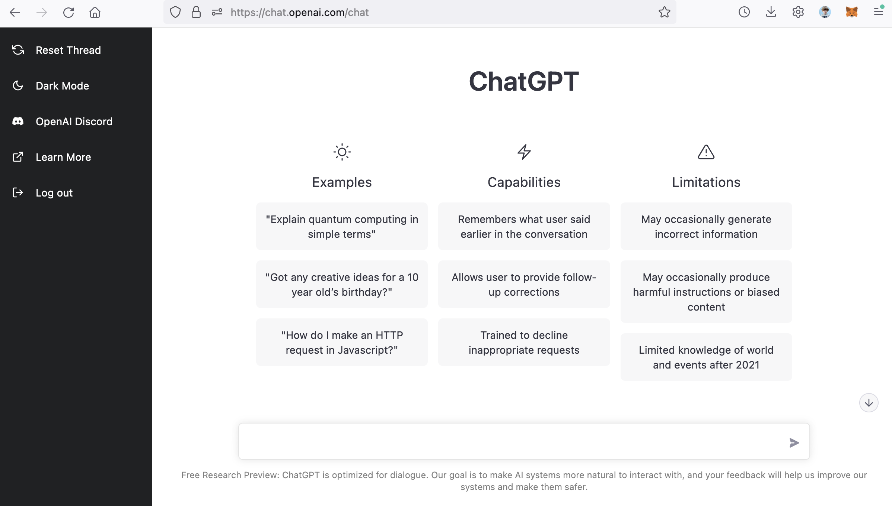
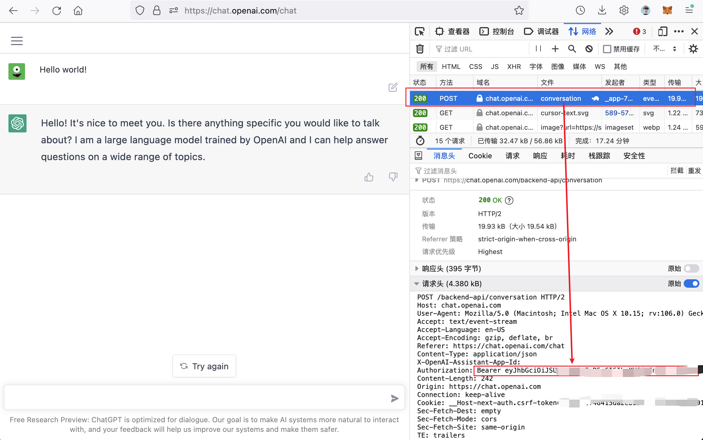
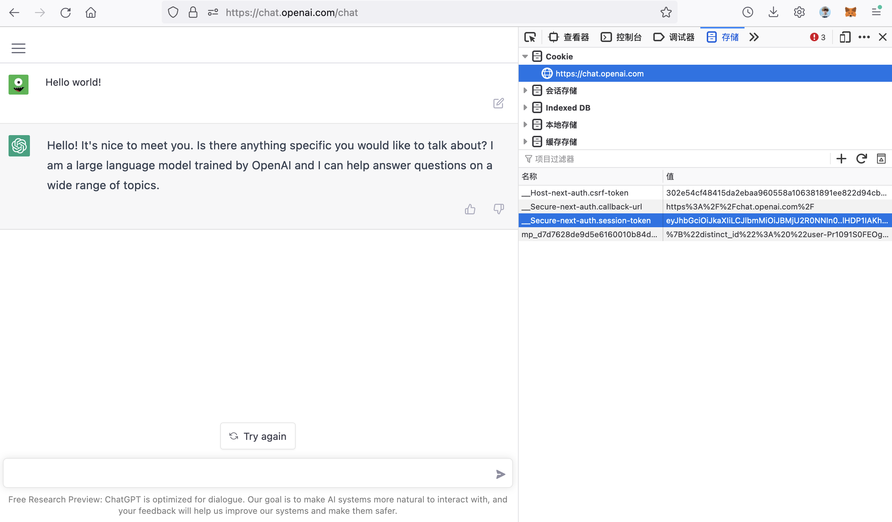

# onekb/ChatGPT

php实现调用ChatGPT，参考TS版本 [idootop/chatgpt-bot](https://github.com/idootop/chatgpt-bot) 编写，感谢作者。部分代码由 ChatGPT 转译。


# Installing

```php
composer require onekb/chat-gpt
```

# Usage
```php
    (new \Onekb\ChatGpt\ChatGpt($sessionToken, $authorization))->ask('你好');
```

# ⚡️ Getting Started

**Step 1. 克隆本项目到本地**

```bash
https://github.com/onekb/ChatGPT.git
```

**Step 2. 配置你的环境变量**

首先，将 `start.php` 文件中的 `$sessionToken` and `$authorization` 字段替换成你自己的 OpenAI 账号参数
> 你可以在这里找到这两个参数值 👉 [教程](#其他)

```php
# start.php

$sessionToken="Your-Authorization"
$authorization="Your-SessionToken"
```

**Step 3. Hello world!**

首先，你的电脑必须有 PHP 环境，然后在项目根目录下执行以下命令

```bash
composer install --no-dev
```

```php
php start.php
```

就酱，准备好起飞 🚀

# 其他

**How to get the `kAuthorization` and `kSessionToken`?**

首先，在你的电脑浏览器上登录 [OpenAI](https://chat.openai.com/chat)

> OpenAI 账号注册教程 👉 [请戳这里](https://juejin.cn/post/7173447848292253704)



登录成功之后，按 `F12` 快捷键，打开浏览器开发者面板



在开发者面板中找到并打开 `网络` 这一栏，然后给 ChatGPT 随便发条消息。 这时候开发者面板里能够看到有许多网络请求，随便选择一个，然后从请求头中找到 `Authorization`，将它的值复制替换掉 `start.php`
里的 `kAuthorization`。



最后，打开 `存储` 这一栏，然后找到名为 `__Secure-next-auth.session-token` 的 Cookie，复制它的值替换掉 `kSessionToken` 即可

以上。

> *PS: `kAuthorization` 和 `kSessionToken` 二选一即可，然后在 `start.php` 里删掉另一个的值*