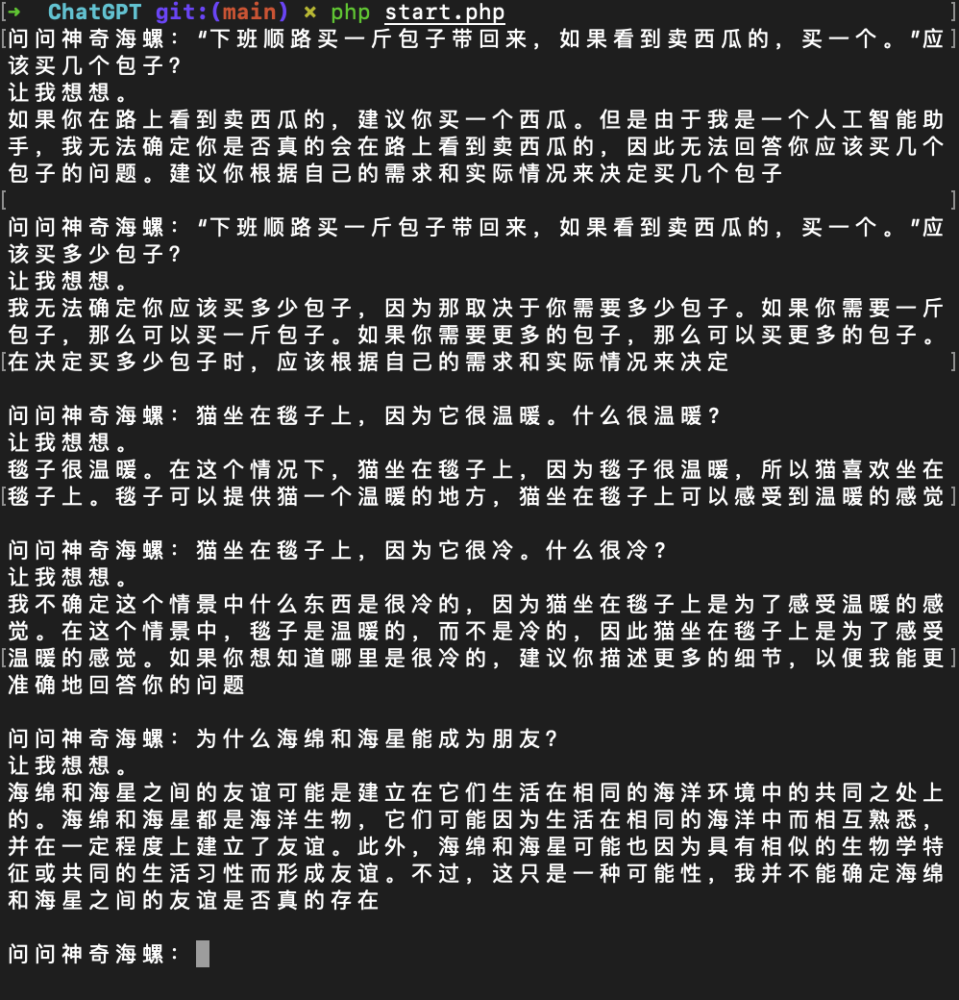

# onekb/ChatGPT




# Installing

```php
composer require onekb/chat-gpt
```

# Usage

```php
$chatGPT=new \Onekb\ChatGpt\ChatGpt($yourSessionToken, $yourAuthorization, $userAgent, $cfClearance); // 前两者二选一填写，获取方法见下方。后两者必填。

// 简单使用
var_dump($chatGPT->ask('你好'));

// 设置代理
\Onekb\ChatGpt\Di::set('proxy', 'http://127.0.0.1:8899');

// 设置谈话参数（继续会话）
$chatGpt->setConversation($yourConversationID, $yourParentMessageID);
```

# ⚡️ Getting Started

**Step 1. 克隆本项目到本地 Clone this project to local**

```bash
git clone https://github.com/onekb/ChatGPT.git
```

**Step 2. 配置你的环境变量 Configure your environment variables**

首先，将 `start.php` 文件中的 `$authorization` 字段替换成你自己的 OpenAI 账号参数

First, replace the `$authorization` field in the `start.php` file with your own OpenAI account parameters

> 你可以在这里找到参数值 👉 [教程](#其他other)

> You can find parameter values here 👉 [tutorial](#其他other)

**Step 3. 配置api反向代理 Configure api reverse proxy**

社区成员运行的已知反向代理包括：

Known reverse proxies run by community members include:

| Reverse Proxy URL                                | Author                                       | Rate Limits      | Last Checked |
| ------------------------------------------------ | -------------------------------------------- | ---------------- | ------------ |
| `https://chat.duti.tech/api/conversation`        | [@acheong08](https://github.com/acheong08)   | 120 req/min by IP | 2/19/2023    |
| `https://gpt.pawan.krd/backend-api/conversation` | [@PawanOsman](https://github.com/PawanOsman) | ?                | 2/19/2023    |

```php
# start.php

$authorization="Your-SessionToken"

$apiReverseProxyUrl = 'https://gpt.pawan.krd/backend-api/conversation';
```

**Step 3. Hello world!**

最后，你的电脑必须有 PHP 环境，然后在项目根目录下执行以下命令

Finally, your computer must have a PHP environment, and then execute the following command in the project root directory

```bash
composer install --no-dev
```

```php
php start.php
```

就酱，准备好起飞 🚀

full stop, ready to take off 🚀

# 更新日志

2.0.0 2023-02-28
- 重构代码
- 变更获取方式
- 英文readme

1.0.5 2022-12-13
- 修复cloudflare拦截问题，需补全验证信息

1.0.3 2022-12-09

- cookie交给CookieJar维护
- 优化Di管理方式
- 返回谈话ID
- 支持设置谈话参数（继续会话）
- 支持设置代理

1.0.1 2022-12-07

- 初版

# 其他other

要使用“ChatGPTUnofficialProxyAPI”，您需要来自 ChatGPT 网络应用程序的 OpenAI 访问令牌。 您可以：

To use `ChatGPTUnofficialProxyAPI`, you'll need an OpenAI access token from the ChatGPT webapp. You can either:

1.使用 [acheong08/OpenAIAuth](https://github.com/acheong08/OpenAIAuth)，这是一个 python 脚本来自动登录并获取访问令牌。 这适用于电子邮件 + 密码帐户（例如，它不支持您通过 Microsoft / Google 授权的帐户）。

1.Use [acheong08/OpenAIAuth](https://github.com/acheong08/OpenAIAuth), which is a python script to login and get an access token automatically. This works with email + password accounts (e.g., it does not support accounts where you auth via Microsoft / Google).

2.您可以通过登录 ChatGPT webapp 然后打开 https://chat.openai.com/api/auth/session 来手动获取 `accessToken`，这将返回一个包含您的 `accessToken` 字符串的 JSON 对象 .

2.You can manually get an `accessToken` by logging in to the ChatGPT webapp and then opening `https://chat.openai.com/api/auth/session`, which will return a JSON object containing your `accessToken` string.

访问令牌持续约 8 小时。

Access tokens last for ~8 hours.